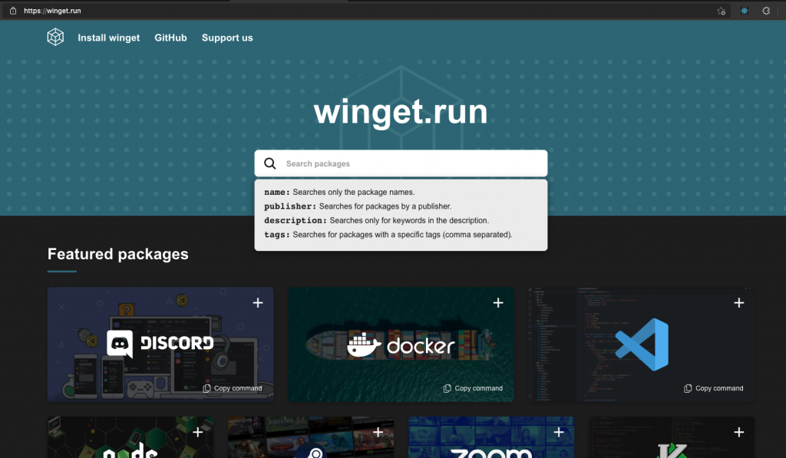

## What is Package Manager

A package manager is a tool in software and programming language ecosystem, which automates the process of installing the software or application with all its dependencies, environments, configurations, easy upgrades for new version and uninstallation.

In this post we are going to see how to install windows package manager and how to search and use install commands to install softwares on Windows system.

## Windows Package Manager (winget) – Introduction

Windows Package Manager or `winget` is a command line tool specific for Windows operating system for installing application on Windows 10 or above version. winget is simple solution to install application in one command, It implementation and usage is same as the Linux package manager.

## Install Windows Package Manager (Windows 10)

In Windows 11 or newer version of Windows 10, the winget will be installed as prebuilt. To check winget is installed type the following command in powershell or windows terminal

```bash
winget --info
```

If windows package manager is not installed don’t worry it can easily downloaded in this [Github Page](https://github.com/microsoft/winget-cli/releases), under the assets download Microsoft.DesktopAppInstaller_xxx.msixbundle and double click it, the installation is same as the installing normal windows application. Once installation is successful we can confirm by typing `winget –info` in powershell or terminal


## WINGET – Install command

The basic commands of windows package manager tool are install, search, list and uninstall.

### Install command

Install command is used to install the application. Syntax for install command is as follows

```bash
winget install <package_name>
```

Example

```bash
winget install -e --id Microsoft.VisualStudioCode
```

The above command is used install Microsoft VSCode application here `-e` checks case sensitivity and `--id` limits the install to the ID of the application

### Search command

The search command will search the available application available.

Syntax:

```bash
winget search <query>
```

### List command

List command will displays the list of application installed on your computer

Syntax:

```bash
winget list <query>
```

### Uninstall command

Uninstall command will uninstall the application which already installed on the computer.

Syntax:

```bash
winget uninstall <package_name>
```

For more syntax check [Microsoft Docs](https://docs.microsoft.com/en-us/windows/package-manager/)

Search install command for applications
---------------------------------------

There are many applications available to be installed using winget. It is difficult to remember all the package names and commands. We can search the specific application using `winget search` command or we can search and find the application in [winget.run](https://winget.run/)

With winget.run you can search the application with queries like application name, author, description or tags.



Here search for the application and click on the listed application to get the exact install command.


Conclusion
----------

If you are from Linux environment or from programming ecosystem you will be loved to use command line tools 😉 . I hope this post helpful for you to install windows package manager on your windows system. If you’ve any doubts or queries drop comment in below comment box.