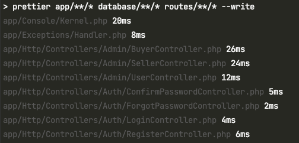

What is Prettier?
-----------------

Prettier is well-known and commonly used in Javascript ecosystem. Prettier is nothing but a code formatter, which re-formats the code in globally used formatting style. It helps to indent your code, creates proper curly braces and many more. In this article we are going to see using prettier in laravel and php application to format your code.

Why we need to use Prettier?
----------------------------

Let's say if you are solo developer, coding good projects on your own without contribution of other developers then it is your own decision to use Prettier. But when you are working as a team, collaborating online with other developers then you need to give freedom on your project to fix or add functionalities to your application. Your application must be easily readable and understandable to other contributors in which Prettier will be very helpful.

Prettier in PHP
---------------

In Javascript application the code can be easily formatted using VSCode plugin just by pressing `shift + alt + f`. But when comes to PHP we need to ensure our code formatter should capable of using PHP Coding Standard Fixers ([PHP CS Fixer](https://github.com/FriendsOfPHP/PHP-CS-Fixer)) which follows PSR and RFC standards. Okay lets first learn how to install and use Prettier in PHP

### How to install and use prettier for PHP

Usually prettier will be installed in `package.json` as dev dependency. since we are using PHP we are going to install [Prettier PHP Plugin](https://github.com/prettier/plugin-php) globally through npm.

```bash
npm install --global prettier @prettier/plugin-php
```

Once prettier is installed globally now you can run `prettier index.php` to format the code for a particular file. If you want to prettify codes of all php file inside a particular folder (lets say app folder) then you can run `prettier app/\*\*.php`.

An example of badly formatted code will be as follow.

```php
<?php
    class FooBar implements FooInterface, BarInterface {
         public function __construct(FooInterface $foo, BarInterface $bar) {}
      public function izumi() { return $this->foo->izumi();}
     public function nakano() { return $this->bar->nakano();
      }}
```

which could be easily prettified using `prettier foobar.php` and formatted code looks as follow

```php
<?php

class FooBar implements FooInterface, BarInterface
{
    public function __construct(FooInterface $foo, BarInterface $bar)
    {
    }

    public function izumi()
    {
        return $this->foo->izumi();
    }

    public function nakano()
    {
        return $this->bar->nakano();
    }
}
```

Note: The formatted code will be displayed only on the terminal, the file will not be rewritten

To rewrite the file pass `--write` parameter

```bash
prettier index.php --write
```

This is how prettify beautifies (rewrites beautifully) your code, which makes your code understandable and more readable.

Using Prettier in Laravel
-------------------------

Cool, now lets learn using Prettier in laravel application. Laravel is a super cool php framework which can be used develop large size application, so prettier will play a great role in Laravel application development.

### How to install Prettier in Laravel along with PHP CS Fixer

First install your [laravel application](https://laravel.com/docs/8.x/installation) . Once you’ve installation completed open your composer.json file edit scripts block as follow

```json
"scripts": {
    "fix-cs": [
        "prettier app/**/* database/**/* routes/**/* --write",
        "php-cs-fixer fix"
    ]
}
```

And finally save composer.json and run

```bash
composer fix-cs
```

Now codes inside app, database, folder inside laravel application will be automatically formatted based on PHP coding standard.



Conclusion
----------

That’s it hope you’ve learned usage of prettier and using prettier in laravel. If you’ve any questions or want to improve my solution use the comment box below or you can contact us.